# RR Diagno Care — Online Test Booking & Lab Management Portal

A classic Java EE / Spring MVC web application for a diagnostics lab. Patients book tests and health packages online
and download their reports, lab technicians enter results, and admins run the centre from a dashboard.

| | |
|---|---|
| **Stack** | Spring MVC 5.3.39 · Spring Security 5.8.16 · Spring JDBC / AOP / TX · JSP + JSTL · Bootstrap 5 |
| **Runtime** | Apache **Tomcat 9.0.x** (`javax.servlet`, Servlet 4.0 / JSP 2.3) · JDK 21+ (built for JDK 24, `release 21`) |
| **Database** | MySQL 8 (HikariCP pool, stored procedure `sp_get_daily_revenue`) |
| **Build** | Maven, `war` packaging. No Spring Boot, no SPA framework |
| **Payments** | No online gateway. Offline `Pay at Center` / `Pay on Home Collection` with `PENDING` → `PAID` status |

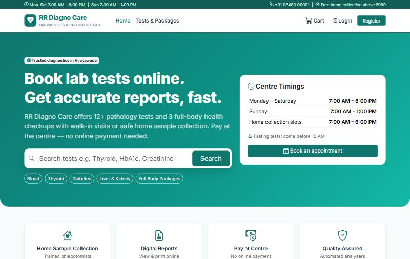

---

## Table of contents

1. [Architecture overview](#1-architecture-overview)
2. [Layers and packages](#2-layers-and-packages)
3. [Request–response lifecycle (step by step)](#3-requestresponse-lifecycle-step-by-step)
4. [Feature flows with sequence diagrams](#4-feature-flows-with-sequence-diagrams)
5. [Data model](#5-data-model)
6. [Security model](#6-security-model)
7. [Screenshots](#7-screenshots)
8. [Project structure](#8-project-structure)
9. [Setup and run guide (MySQL + IntelliJ + Tomcat 9)](#9-setup-and-run-guide)
10. [Default logins](#10-default-logins)
11. [Implementation notes](#11-implementation-notes)

---

## 1. Architecture overview

The application is a **server-side rendered, layered monolith** deployed as one WAR on Tomcat 9.
Every browser request passes through servlet filters, then Spring Security, and then either the Spring MVC
`DispatcherServlet` or one of three plain `HttpServlet`s. Business logic lives in Spring services
(transactions and AOP), and data access uses `JdbcTemplate` against MySQL.

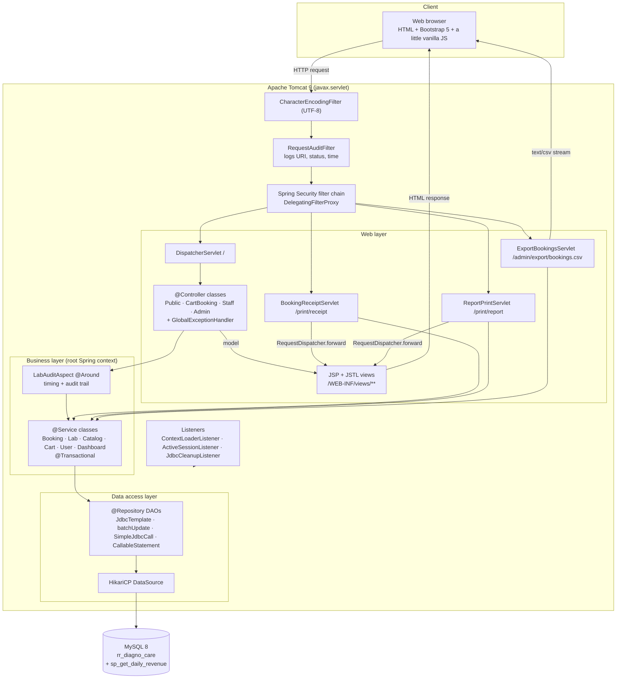
```mermaid
flowchart TB
    subgraph Client["Client"]
        B["Web browser<br/>HTML + Bootstrap 5 + a little vanilla JS"]
    end

    subgraph Tomcat["Apache Tomcat 9 (javax.servlet)"]
        direction TB
        L["Listeners<br/>ContextLoaderListener · ActiveSessionListener · JdbcCleanupListener"]
        F1["CharacterEncodingFilter (UTF-8)"]
        F2["RequestAuditFilter<br/>logs URI, status, time"]
        F3["Spring Security filter chain<br/>DelegatingFilterProxy"]

        subgraph Web["Web layer"]
            DS["DispatcherServlet  /"]
            C["@Controller classes<br/>Public · CartBooking · Staff · Admin<br/>+ GlobalExceptionHandler"]
            S1["BookingReceiptServlet  /print/receipt"]
            S2["ReportPrintServlet  /print/report"]
            S3["ExportBookingsServlet  /admin/export/bookings.csv"]
            V["JSP + JSTL views<br/>/WEB-INF/views/**"]
        end

        subgraph Biz["Business layer (root Spring context)"]
            AOP["LabAuditAspect @Around<br/>timing + audit trail"]
            SVC["@Service classes<br/>Booking · Lab · Catalog · Cart · User · Dashboard<br/>@Transactional"]
        end

        subgraph Data["Data access layer"]
            DAO["@Repository DAOs<br/>JdbcTemplate · batchUpdate · SimpleJdbcCall · CallableStatement"]
            POOL["HikariCP DataSource"]
        end
    end

    DB[("MySQL 8<br/>rr_diagno_care<br/>+ sp_get_daily_revenue")]

    B -- "HTTP request" --> F1 --> F2 --> F3
    F3 --> DS --> C
    F3 --> S1 & S2 & S3
    C --> AOP --> SVC
    S1 & S2 & S3 --> SVC
    SVC --> DAO --> POOL --> DB
    C -- "model" --> V
    S1 & S2 -- "RequestDispatcher.forward" --> V
    V -- "HTML response" --> B
    S3 -- "text/csv stream" --> B
    L -.-> Tomcat
```

### Two Spring application contexts

| Context | Created by | Config file | Contains |
|---|---|---|---|
| **Root** context | `ContextLoaderListener` | `WEB-INF/applicationContext.xml` | DataSource, `JdbcTemplate`, transaction manager, DAOs, services, `LabAuditAspect`, Spring Security (`<http>`, `UserDetailsService`, `BCryptPasswordEncoder`) |
| **Web** (child) context | `DispatcherServlet` | `WEB-INF/dispatcher-servlet.xml` | `@Controller`s, `@ControllerAdvice`, view resolver, static resources, `@AuthenticationPrincipal` resolver |

The plain servlets read beans from the root context with `WebApplicationContextUtils` (see `BaseSpringServlet`).

---

## 2. Layers and packages

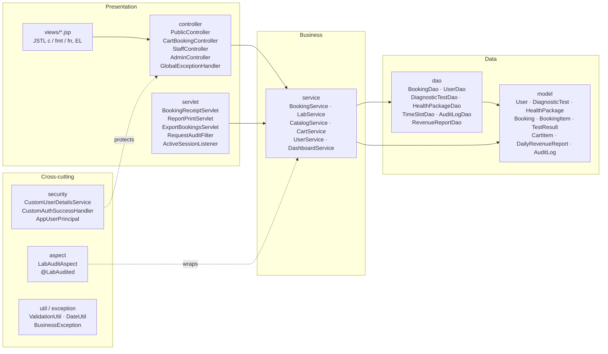
```mermaid
flowchart LR
    subgraph presentation["Presentation"]
        JSP["views/*.jsp<br/>JSTL c / fmt / fn, EL"]
        CTRL["controller<br/>PublicController<br/>CartBookingController<br/>StaffController<br/>AdminController<br/>GlobalExceptionHandler"]
        SRV["servlet<br/>BookingReceiptServlet<br/>ReportPrintServlet<br/>ExportBookingsServlet<br/>RequestAuditFilter<br/>ActiveSessionListener"]
    end
    subgraph cross["Cross-cutting"]
        SEC["security<br/>CustomUserDetailsService<br/>CustomAuthSuccessHandler<br/>AppUserPrincipal"]
        ASP["aspect<br/>LabAuditAspect<br/>@LabAudited"]
        UTIL["util / exception<br/>ValidationUtil · DateUtil<br/>BusinessException"]
    end
    subgraph business["Business"]
        SVC["service<br/>BookingService · LabService<br/>CatalogService · CartService<br/>UserService · DashboardService"]
    end
    subgraph data["Data"]
        DAO["dao<br/>BookingDao · UserDao<br/>DiagnosticTestDao · HealthPackageDao<br/>TimeSlotDao · AuditLogDao<br/>RevenueReportDao"]
        MODEL["model<br/>User · DiagnosticTest · HealthPackage<br/>Booking · BookingItem · TestResult<br/>CartItem · DailyRevenueReport · AuditLog"]
    end
    JSP --> CTRL
    CTRL --> SVC
    SRV --> SVC
    ASP -. "wraps" .-> SVC
    SEC -. "protects" .-> CTRL
    SVC --> DAO
    DAO --> MODEL
    SVC --> MODEL
```

| Package | Responsibility | Key techniques |
|---|---|---|
| `model` | POJOs plus presentation helpers (formatted dates, badge colours, abnormal flags) | `Serializable` (cart lives in `HttpSession`) |
| `dao` | SQL access | `JdbcTemplate` + `PreparedStatement`, `batchUpdate`, `SimpleJdbcCall`, explicit `CallableStatement`, `SELECT … FOR UPDATE` |
| `service` | Rules and validation | Constructor injection, `@Transactional`, phone/date validation |
| `aspect` | Audit and performance | `@Aspect`, `@Around`, custom `@LabAudited` annotation |
| `security` | Authentication and authorisation | DB-backed `UserDetailsService`, BCrypt, role redirect after login |
| `controller` | HTTP ↔ service ↔ view | `@Controller`, `RedirectAttributes` flash messages, `@ControllerAdvice` |
| `servlet` | Plain Java EE components | `HttpServlet`, `RequestDispatcher`, `Filter`, `HttpSessionListener` |

---

## 3. Request–response lifecycle (step by step)

This is the path of a typical request. The example is a lab technician saving results: `POST /staff/results/2`.

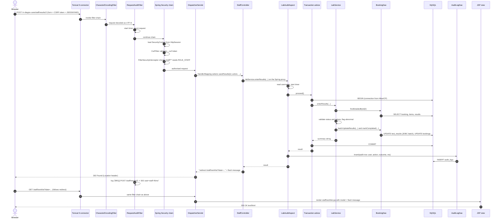
```mermaid
sequenceDiagram
    autonumber
    actor U as Browser
    participant T as Tomcat 9 connector
    participant EF as CharacterEncodingFilter
    participant RA as RequestAuditFilter
    participant SS as Spring Security chain
    participant DS as DispatcherServlet
    participant SC as StaffController
    participant AX as LabAuditAspect
    participant TX as Transaction advice
    participant LS as LabService
    participant DAO as BookingDao
    participant DB as MySQL
    participant AL as AuditLogDao
    participant V as JSP view

    U->>T: POST /rr-diagno-care/staff/results/2 (form + CSRF token + JSESSIONID)
    T->>EF: invoke filter chain
    EF->>RA: request decoded as UTF-8
    RA->>RA: start timer, count request
    RA->>SS: continue chain
    SS->>SS: load SecurityContext from HttpSession
    SS->>SS: CsrfFilter validates _csrf token
    SS->>SS: FilterSecurityInterceptor checks /staff/** needs ROLE_STAFF
    SS->>DS: authorised request
    DS->>SC: HandlerMapping selects saveResults(id, action, ...)
    SC->>AX: labService.enterResults(...) on the Spring proxy
    AX->>AX: read username, start timer
    AX->>TX: proceed()
    TX->>DB: BEGIN (connection from HikariCP)
    TX->>LS: enterResults(...)
    LS->>DAO: findDetailedById(2)
    DAO->>DB: SELECT booking, items, results
    LS->>LS: validate status and values, flag abnormal
    LS->>DAO: batchUpdateResults(...) and markCompleted(...)
    DAO->>DB: UPDATE test_results (JDBC batch), UPDATE bookings
    LS-->>TX: summary string
    TX->>DB: COMMIT
    TX-->>AX: result
    AX->>AL: insert(audit row: user, action, outcome, ms)
    AL->>DB: INSERT audit_logs
    AX-->>SC: result
    SC-->>DS: "redirect:/staff/worklist?date=..." + flash message
    DS-->>U: 302 Found (Location header)
    RA->>RA: log "[REQ] POST /staff/results/2 -> 302 user=staff 45ms"
    U->>T: GET /staff/worklist?date=... (follows redirect)
    T->>DS: same filter chain as above
    DS->>V: render staff/worklist.jsp with model + flash message
    V-->>U: 200 OK text/html
```

**What each step does**

| # | Component | What happens |
|---|---|---|
| 1 | Browser | Submits the form. Every POST form includes the hidden `_csrf` field and the session cookie `JSESSIONID`. |
| 2–3 | `CharacterEncodingFilter` | Forces UTF-8 so names and the ₹ symbol survive. |
| 4–5 | `RequestAuditFilter` | Starts a timer and increments the `totalRequests` counter in the `ServletContext`. |
| 6–9 | Spring Security | Restores the logged-in user from the session, checks the CSRF token, then checks the URL rule (`/staff/**` → `ROLE_STAFF`). Failures become a redirect to `/login` or a 403 page. |
| 10 | `DispatcherServlet` | Maps the URL to the controller method and binds request parameters. `@AuthenticationPrincipal` injects the logged-in user. |
| 11–13 | `LabAuditAspect` | Spring returns a **proxy** for `LabService`. The aspect runs first (order 0) and records who called and when. |
| 14–15 | Transaction advice | `@Transactional` opens a JDBC transaction on a pooled connection. |
| 16–21 | Service and DAO | Business validation, then parameterized SQL. Multiple rows go in one JDBC batch. |
| 22–23 | Commit | On success the transaction commits. Any `RuntimeException` rolls back everything. |
| 24–26 | Audit | After the transaction ends, the aspect writes an `audit_logs` row (`SUCCESS` or `FAILURE` plus execution time), so failures are kept too. |
| 27–28 | Post/Redirect/Get | The controller returns a redirect with a flash message, so a browser refresh never re-submits the form. |
| 29 | `RequestAuditFilter` | Logs method, URI, status, user and duration when the response unwinds. |
| 30–33 | View rendering | The follow-up GET renders a JSP. JSTL loops and conditions turn the model into HTML. |

Errors are handled in one place:

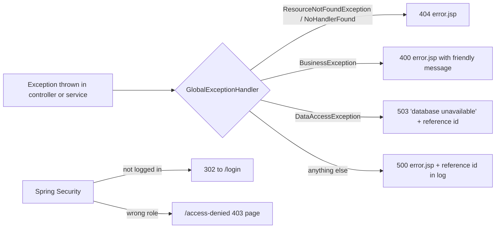
```mermaid
flowchart LR
    EX["Exception thrown in controller or service"] --> GEH{"GlobalExceptionHandler"}
    GEH -- "ResourceNotFoundException / NoHandlerFound" --> E404["404 error.jsp"]
    GEH -- "BusinessException" --> E400["400 error.jsp with friendly message"]
    GEH -- "DataAccessException" --> E503["503 'database unavailable' + reference id"]
    GEH -- "anything else" --> E500["500 error.jsp + reference id in log"]
    SECX["Spring Security"] -- "not logged in" --> LOGIN["302 to /login"]
    SECX -- "wrong role" --> E403["/access-denied 403 page"]
```

Most business errors never reach the handler. Controllers catch `BusinessException`, then re-show the form with the
user's input kept, or redirect with a flash `error` message.

---

## 4. Feature flows with sequence diagrams

### 4.1 Login and role-based redirect

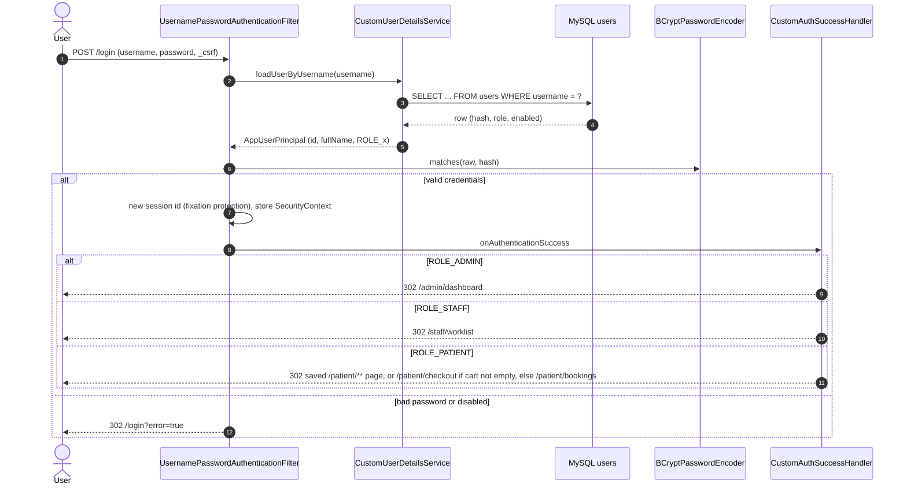
```mermaid
sequenceDiagram
    autonumber
    actor U as User
    participant SEC as UsernamePasswordAuthenticationFilter
    participant UDS as CustomUserDetailsService
    participant DB as MySQL users
    participant ENC as BCryptPasswordEncoder
    participant H as CustomAuthSuccessHandler

    U->>SEC: POST /login (username, password, _csrf)
    SEC->>UDS: loadUserByUsername(username)
    UDS->>DB: SELECT ... FROM users WHERE username = ?
    DB-->>UDS: row (hash, role, enabled)
    UDS-->>SEC: AppUserPrincipal (id, fullName, ROLE_x)
    SEC->>ENC: matches(raw, hash)
    alt valid credentials
        SEC->>SEC: new session id (fixation protection), store SecurityContext
        SEC->>H: onAuthenticationSuccess
        alt ROLE_ADMIN
            H-->>U: 302 /admin/dashboard
        else ROLE_STAFF
            H-->>U: 302 /staff/worklist
        else ROLE_PATIENT
            H-->>U: 302 saved /patient/** page, or /patient/checkout if cart not empty, else /patient/bookings
        end
    else bad password or disabled
        SEC-->>U: 302 /login?error=true
    end
```

### 4.2 Session cart → checkout → atomic booking

1. **Browse:** `GET /tests?category=Thyroid&q=…` → `PublicController` → `CatalogService` → `DiagnosticTestDao.search` / `HealthPackageDao.search` → `tests.jsp`.
2. **Add to cart:** `POST /cart/add` → `CartService.add` reloads the item's current price from the DB and appends a `CartItem` to the `List` held in `HttpSession` under `cart`. Then 302 back to the catalog. The navbar badge reads `fn:length(sessionScope.cart)`.
3. **Checkout:** `GET /patient/checkout` (login required). The page lists every slot's remaining capacity. When the date changes, JavaScript calls `GET /patient/slots?date=…` (JSON) and redraws the slot buttons.
4. **Confirm:** `POST /patient/checkout` → `BookingService.createBooking` runs in **one transaction**:

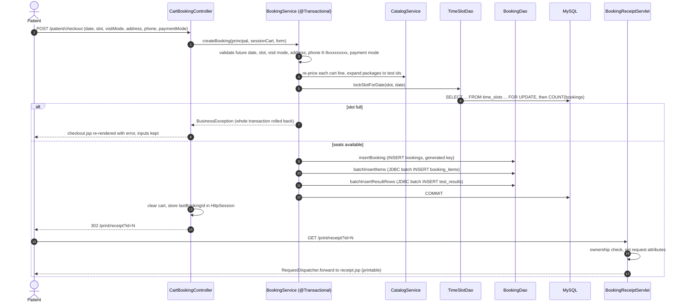
```mermaid
sequenceDiagram
    autonumber
    actor P as Patient
    participant C as CartBookingController
    participant BS as BookingService (@Transactional)
    participant CS as CatalogService
    participant TS as TimeSlotDao
    participant BD as BookingDao
    participant DB as MySQL
    participant RS as BookingReceiptServlet

    P->>C: POST /patient/checkout (date, slot, visitMode, address, phone, paymentMode)
    C->>BS: createBooking(principal, sessionCart, form)
    BS->>BS: validate future date, slot, visit mode, address, phone 6-9xxxxxxxxx, payment mode
    BS->>CS: re-price each cart line, expand packages to test ids
    BS->>TS: lockSlotForDate(slot, date)
    TS->>DB: SELECT ... FROM time_slots ... FOR UPDATE, then COUNT(bookings)
    alt slot full
        BS-->>C: BusinessException (whole transaction rolled back)
        C-->>P: checkout.jsp re-rendered with error, inputs kept
    else seats available
        BS->>BD: insertBooking  (INSERT bookings, generated key)
        BS->>BD: batchInsertItems  (JDBC batch INSERT booking_items)
        BS->>BD: batchInsertResultRows  (JDBC batch INSERT test_results)
        BS->>DB: COMMIT
        C->>C: clear cart, store lastBookingId in HttpSession
        C-->>P: 302 /print/receipt?id=N
        P->>RS: GET /print/receipt?id=N
        RS->>RS: ownership check, set request attributes
        RS-->>P: RequestDispatcher.forward to receipt.jsp (printable)
    end
```

5. **Track:** `GET /patient/bookings` shows a status tracker for each booking. A patient can cancel only while the booking is `BOOKED`. The cancel uses a guarded `UPDATE … WHERE status='BOOKED'`, so it can't race a technician.
6. **Report:** `GET /patient/bookings/{id}` → `view-report.jsp`. `GET /print/report?id=` → `ReportPrintServlet` → `report-print.jsp`. Values outside the reference range are drawn in **red/bold** by `<c:choose>` in `common/result-table.jsp`.

### 4.3 Booking status lifecycle

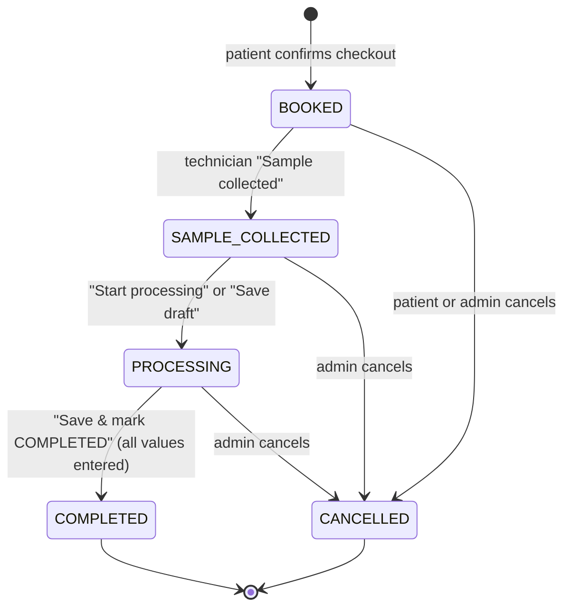
```mermaid
stateDiagram-v2
    [*] --> BOOKED: patient confirms checkout
    BOOKED --> SAMPLE_COLLECTED: technician "Sample collected"
    BOOKED --> CANCELLED: patient or admin cancels
    SAMPLE_COLLECTED --> PROCESSING: "Start processing" or "Save draft"
    SAMPLE_COLLECTED --> CANCELLED: admin cancels
    PROCESSING --> COMPLETED: "Save & mark COMPLETED" (all values entered)
    PROCESSING --> CANCELLED: admin cancels
    COMPLETED --> [*]
    CANCELLED --> [*]
```

`payment_status` is separate: `PENDING` → `PAID`, toggled by the admin when cash, UPI or card is received offline.

### 4.4 Admin dashboard and stored procedure

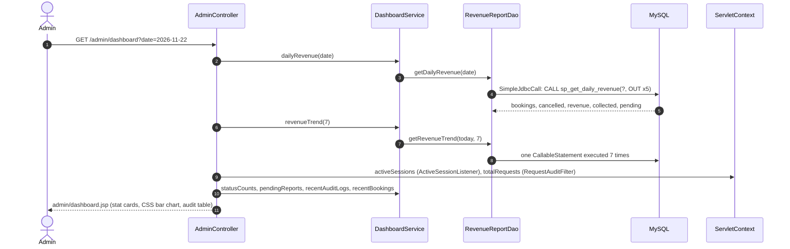
```mermaid
sequenceDiagram
    autonumber
    actor A as Admin
    participant AC as AdminController
    participant DSV as DashboardService
    participant RR as RevenueReportDao
    participant DB as MySQL
    participant CTX as ServletContext

    A->>AC: GET /admin/dashboard?date=2026-11-22
    AC->>DSV: dailyRevenue(date)
    DSV->>RR: getDailyRevenue(date)
    RR->>DB: SimpleJdbcCall: CALL sp_get_daily_revenue(?, OUT x5)
    DB-->>RR: bookings, cancelled, revenue, collected, pending
    AC->>DSV: revenueTrend(7)
    DSV->>RR: getRevenueTrend(today, 7)
    RR->>DB: one CallableStatement executed 7 times
    AC->>CTX: activeSessions (ActiveSessionListener), totalRequests (RequestAuditFilter)
    AC->>DSV: statusCounts, pendingReports, recentAuditLogs, recentBookings
    AC-->>A: admin/dashboard.jsp (stat cards, CSS bar chart, audit table)
```

The stored procedure (in `database/schema.sql`):

```sql
CREATE PROCEDURE sp_get_daily_revenue(IN p_date DATE,
       OUT p_total_bookings INT, OUT p_cancelled INT,
       OUT p_total_revenue DECIMAL(12,2), OUT p_collected_revenue DECIMAL(12,2), OUT p_pending_revenue DECIMAL(12,2))
```

### 4.5 CSV export (plain servlet, streaming)

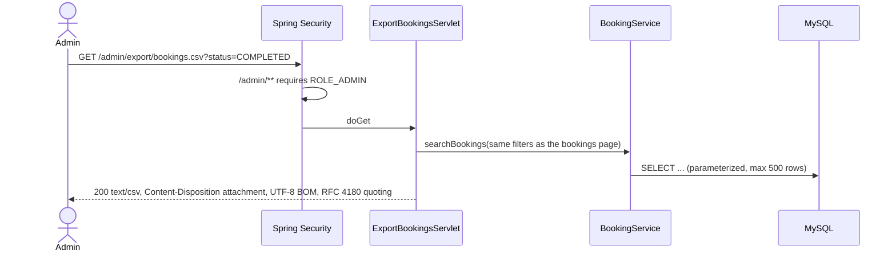
```mermaid
sequenceDiagram
    actor A as Admin
    participant SS as Spring Security
    participant EX as ExportBookingsServlet
    participant BS as BookingService
    participant DB as MySQL
    A->>SS: GET /admin/export/bookings.csv?status=COMPLETED
    SS->>SS: /admin/** requires ROLE_ADMIN
    SS->>EX: doGet
    EX->>BS: searchBookings(same filters as the bookings page)
    BS->>DB: SELECT ... (parameterized, max 500 rows)
    EX-->>A: 200 text/csv, Content-Disposition attachment, UTF-8 BOM, RFC 4180 quoting
```

---

## 5. Data model

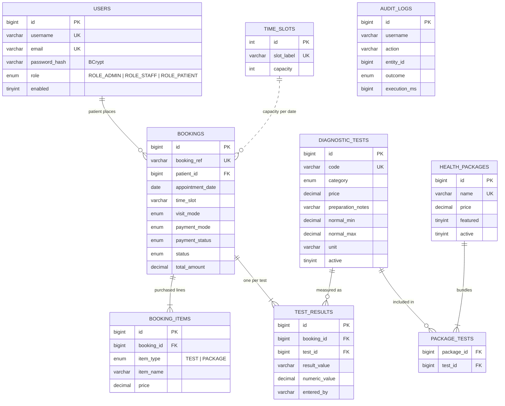
```mermaid
erDiagram
    USERS ||--o{ BOOKINGS : "patient places"
    BOOKINGS ||--|{ BOOKING_ITEMS : "purchased lines"
    BOOKINGS ||--|{ TEST_RESULTS : "one per test"
    DIAGNOSTIC_TESTS ||--o{ TEST_RESULTS : "measured as"
    HEALTH_PACKAGES ||--|{ PACKAGE_TESTS : bundles
    DIAGNOSTIC_TESTS ||--o{ PACKAGE_TESTS : "included in"
    TIME_SLOTS ||..o{ BOOKINGS : "capacity per date"

    USERS {
        bigint id PK
        varchar username UK
        varchar email UK
        varchar password_hash "BCrypt"
        enum role "ROLE_ADMIN | ROLE_STAFF | ROLE_PATIENT"
        tinyint enabled
    }
    DIAGNOSTIC_TESTS {
        bigint id PK
        varchar code UK
        enum category
        decimal price
        varchar preparation_notes
        decimal normal_min
        decimal normal_max
        varchar unit
        tinyint active
    }
    HEALTH_PACKAGES {
        bigint id PK
        varchar name UK
        decimal price
        tinyint featured
        tinyint active
    }
    PACKAGE_TESTS {
        bigint package_id FK
        bigint test_id FK
    }
    TIME_SLOTS {
        int id PK
        varchar slot_label UK
        int capacity
    }
    BOOKINGS {
        bigint id PK
        varchar booking_ref UK
        bigint patient_id FK
        date appointment_date
        varchar time_slot
        enum visit_mode
        enum payment_mode
        enum payment_status
        enum status
        decimal total_amount
    }
    BOOKING_ITEMS {
        bigint id PK
        bigint booking_id FK
        enum item_type "TEST | PACKAGE"
        varchar item_name
        decimal price
    }
    TEST_RESULTS {
        bigint id PK
        bigint booking_id FK
        bigint test_id FK
        varchar result_value
        decimal numeric_value
        varchar entered_by
    }
    AUDIT_LOGS {
        bigint id PK
        varchar username
        varchar action
        bigint entity_id
        enum outcome
        bigint execution_ms
    }
```

`booking_items` keeps what the patient **bought** (for receipts). `test_results` keeps one row for each **individual test**,
with packages expanded, which is what the technician fills in.

---

## 6. Security model

| URL pattern | Access rule | Notes |
|---|---|---|
| `/assets/**` | no security filter | CSS and static files |
| `/`, `/tests`, `/cart/**`, `/login`, `/register` | `permitAll` | anonymous users can browse and fill a cart |
| `/patient/**` | `hasRole('PATIENT')` | checkout, my bookings, reports, cancel |
| `/staff/**` | `hasRole('STAFF')` | worklist, result entry |
| `/admin/**` (incl. CSV servlet) | `hasRole('ADMIN')` | dashboard, CRUD, bookings, staff |
| `/print/**` | `isAuthenticated()` | servlets also check ownership: patients see only their own bookings |

* Passwords: **BCrypt** (strength 10). Accounts can be disabled by the admin.
* **CSRF** protection is on. Every POST form carries `${_csrf.token}`, and logout is a POST.
* Session fixation protection (`migrateSession`), so the cart survives login. Cookies are HttpOnly.
* All SQL is parameterized. JSP output uses `<c:out>` / `fn:escapeXml` for user data. CSV cells are guarded against formula injection.

---

## 7. Screenshots

All screenshots were taken from the application running on Tomcat 9.0.98 with the seed data.

### Public pages and patient flow

| Home | Test catalog (category filter) |
|---|---|
|  | 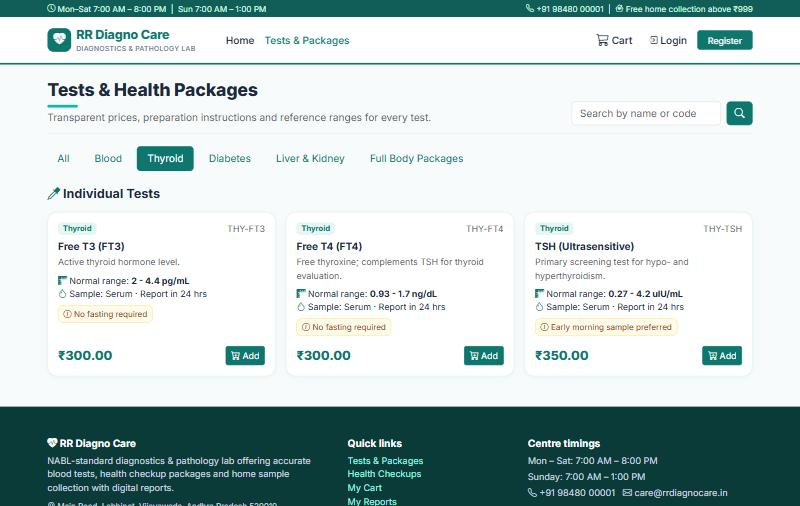 |
| **Health packages with MRP and discount** | **Session cart** |
| 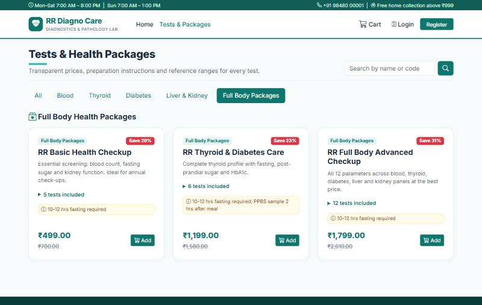 | 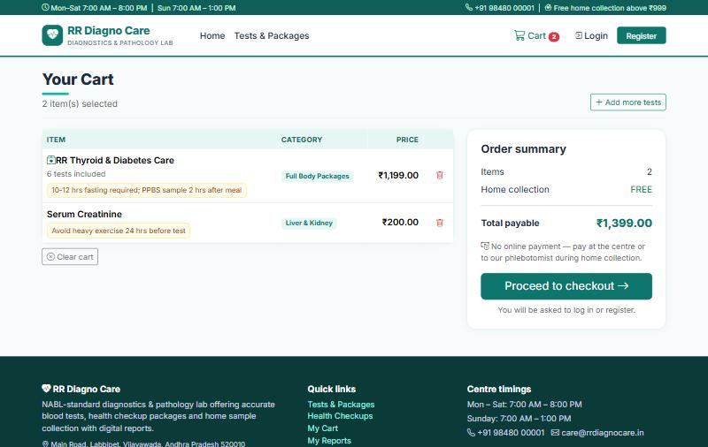 |
| **Login** | **Patient registration** |
| 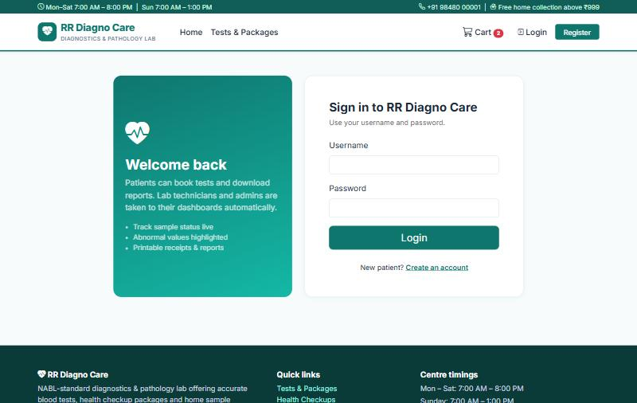 | 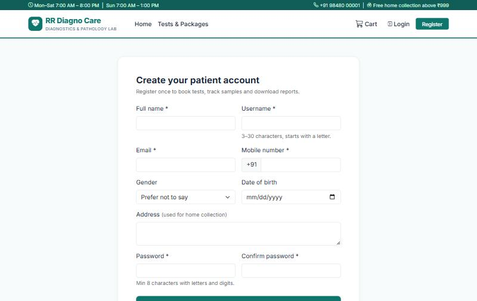 |
| **Checkout: date and live slot capacity** | **Checkout: visit type and offline payment** |
| 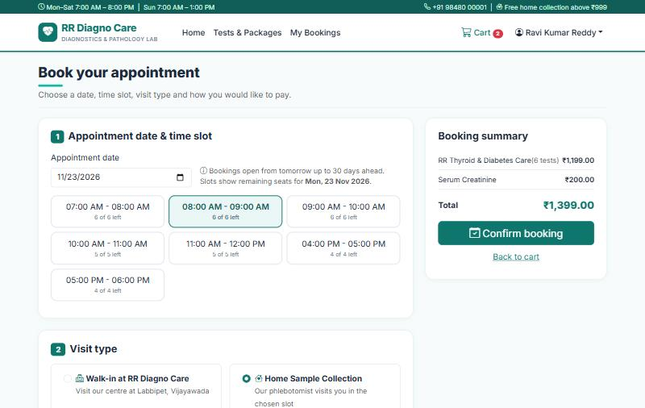 | 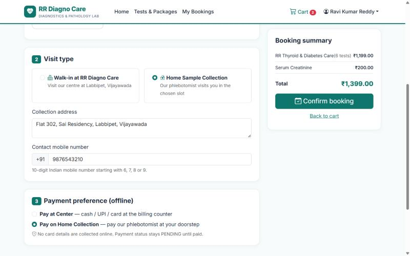 |
| **Booking receipt (`BookingReceiptServlet`)** | **My Bookings with live status tracker** |
| 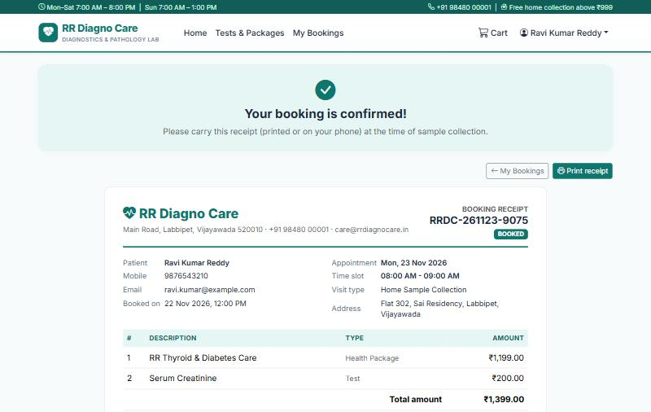 | 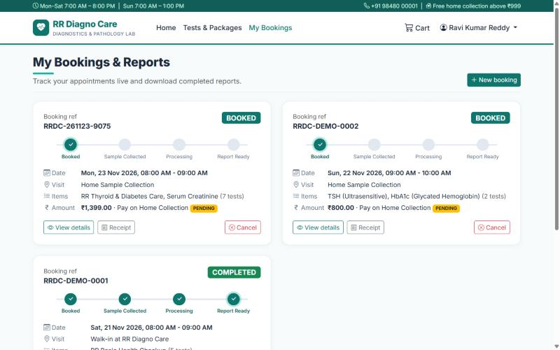 |
| **Lab report: abnormal value in red/bold** | **Print-ready report (`ReportPrintServlet`)** |
| 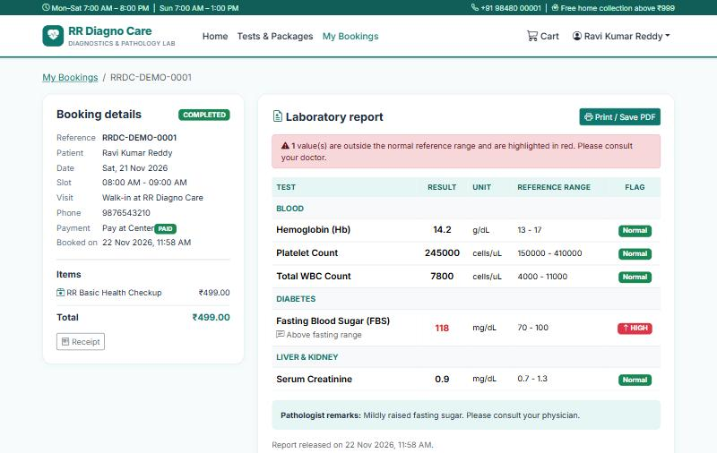 | 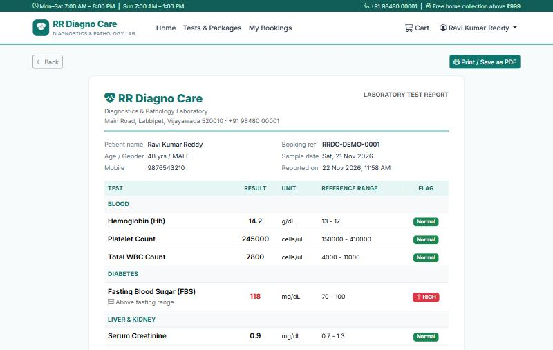 |

### Lab Technician

| Daily worklist | Result entry with live out-of-range hint |
|---|---|
| 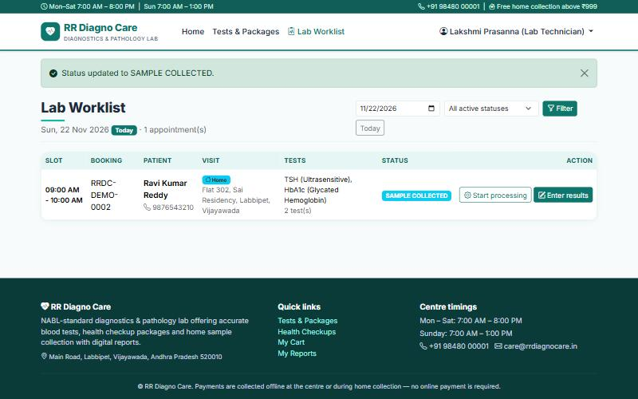 | 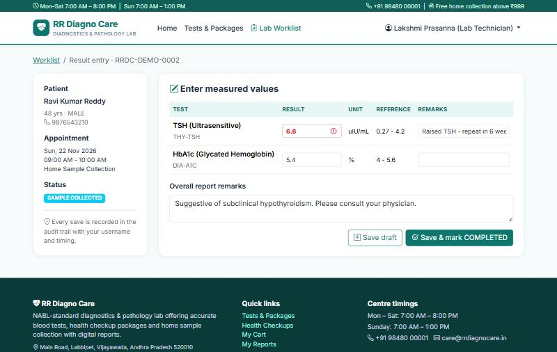 |

### Admin

| Dashboard (stored-procedure revenue) | AOP audit trail and recent bookings |
|---|---|
| 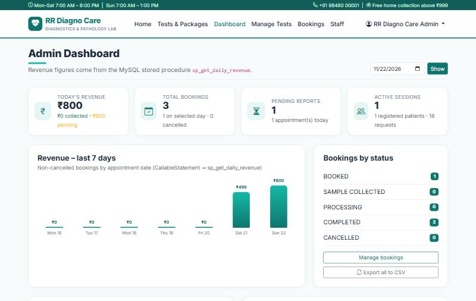 | 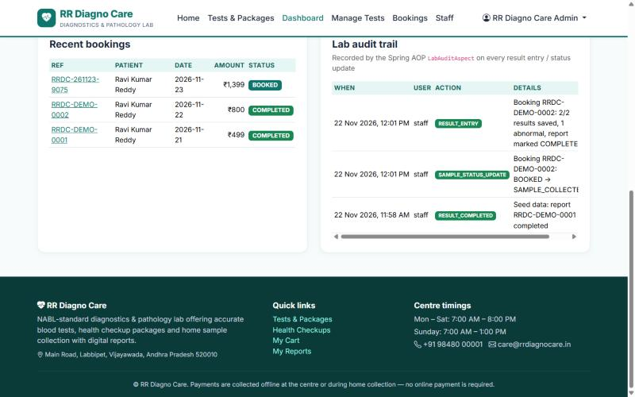 |
| **Manage tests (CRUD)** | **Manage packages (bundle tests, discount)** |
| 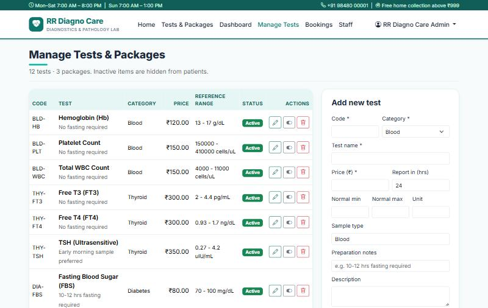 | 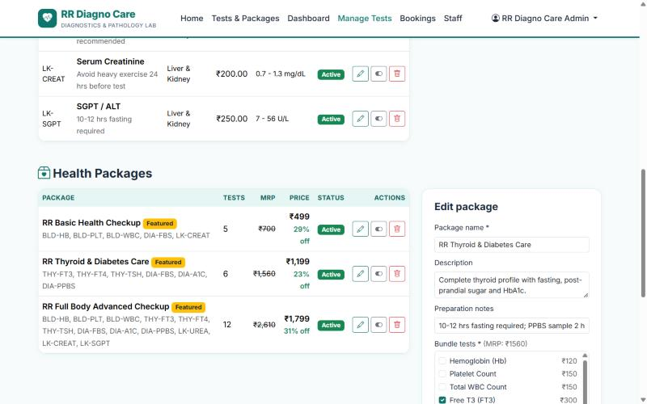 |
| **Bookings: filter, mark PAID, export CSV** | **Lab technician accounts** |
| 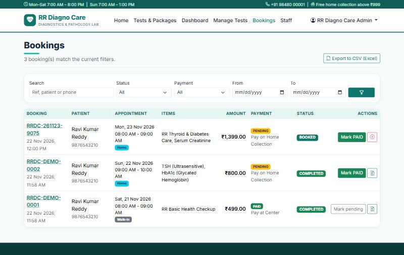 | 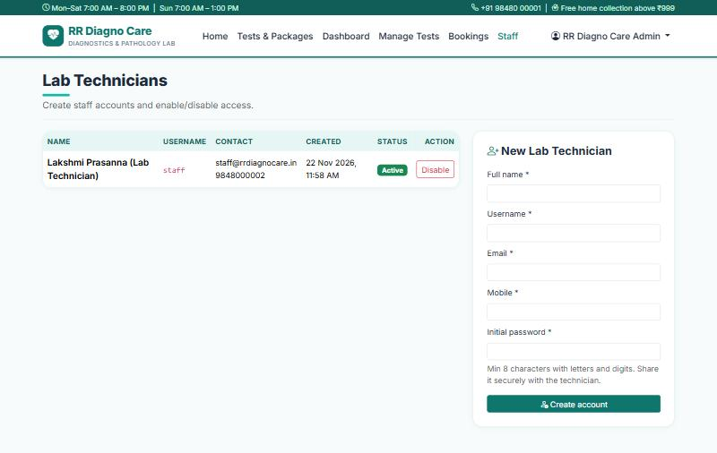 |

### Responsive (phone width)

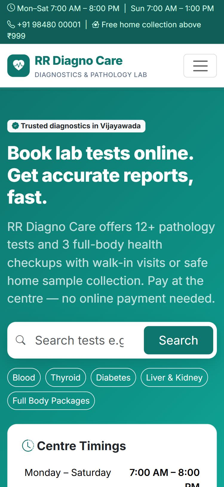

---

## 8. Project structure

```
rr-diagno-care/
├── pom.xml                          WAR packaging · Spring 5.3.39 · Security 5.8.16 · release 21
├── .gitignore
├── database/
│   ├── schema.sql                   database, tables, indexes, sp_get_daily_revenue
│   └── data.sql                     12 tests, 3 packages, 7 slots, 3 users, demo bookings
├── docs/screenshots/                images used in this README
└── src/main/
    ├── java/com/rrdiagnocare/
    │   ├── model/        User, DiagnosticTest, HealthPackage, Booking, BookingItem, CartItem,
    │   │                 DailyRevenueReport, AuditLog, TestResult, TimeSlot, CheckoutForm
    │   ├── dao/          UserDao, DiagnosticTestDao, HealthPackageDao, BookingDao, TimeSlotDao,
    │   │                 AuditLogDao, RevenueReportDao
    │   ├── servlet/      BookingReceiptServlet, ReportPrintServlet, ExportBookingsServlet,
    │   │                 RequestAuditFilter, ActiveSessionListener, JdbcCleanupListener, BaseSpringServlet
    │   ├── service/      BookingService, LabService, CatalogService, CartService, UserService, DashboardService
    │   ├── aspect/       LabAuditAspect, LabAudited
    │   ├── security/     CustomUserDetailsService, CustomAuthSuccessHandler, AppUserPrincipal, SecurityUtil
    │   ├── controller/   PublicController, CartBookingController, StaffController, AdminController,
    │   │                 GlobalExceptionHandler
    │   ├── exception/    BusinessException, ResourceNotFoundException
    │   └── util/         AppConstants, DateUtil, ValidationUtil
    ├── resources/
    │   ├── db.properties              JDBC URL / user / password  <-- edit this
    │   └── simplelogger.properties
    └── webapp/
        ├── assets/css/app.css         white & teal theme
        └── WEB-INF/
            ├── web.xml                listeners, filters, servlets, JSP config, error pages
            ├── applicationContext.xml DataSource, JdbcTemplate, tx, AOP, Spring Security
            ├── dispatcher-servlet.xml MVC, resources, view resolver
            └── views/
                ├── common/  taglibs.jspf · header.jsp · footer.jsp · result-table.jsp
                ├── index · tests · cart · checkout · my-bookings · view-report
                ├── login · register · error · receipt · report-print
                ├── staff/   worklist · enter-result
                └── admin/   dashboard · manage-tests · bookings · staff
```

### URL map

| Method & URL | Handler | View / result |
|---|---|---|
| `GET /` | `PublicController.home` | `index.jsp` |
| `GET /tests?category=&q=` | `PublicController.catalog` | `tests.jsp` |
| `GET/POST /register`, `GET /login` | `PublicController` | `register.jsp`, `login.jsp` (POST `/login` is handled by Spring Security) |
| `GET /cart`, `POST /cart/add · /cart/remove · /cart/clear` | `CartBookingController` | `cart.jsp` / redirect |
| `GET/POST /patient/checkout`, `GET /patient/slots` | `CartBookingController` | `checkout.jsp`, JSON |
| `GET /patient/bookings`, `GET /patient/bookings/{id}`, `POST …/{id}/cancel` | `CartBookingController` | `my-bookings.jsp`, `view-report.jsp` |
| `GET /print/receipt?id=` | `BookingReceiptServlet` | `receipt.jsp` |
| `GET /print/report?id=` | `ReportPrintServlet` | `report-print.jsp` |
| `GET /staff/worklist`, `POST /staff/bookings/{id}/status` | `StaffController` | `staff/worklist.jsp` |
| `GET/POST /staff/results/{id}` | `StaffController` | `staff/enter-result.jsp` |
| `GET /admin/dashboard` | `AdminController` | `admin/dashboard.jsp` |
| `GET /admin/tests`, `POST /admin/tests/save · /{id}/toggle · /{id}/delete`, `POST /admin/packages/…` | `AdminController` | `admin/manage-tests.jsp` |
| `GET /admin/bookings`, `POST /admin/bookings/{id}/payment · /cancel` | `AdminController` | `admin/bookings.jsp` |
| `GET /admin/export/bookings.csv` | `ExportBookingsServlet` | CSV download |
| `GET/POST /admin/staff`, `POST /admin/staff/{id}/toggle` | `AdminController` | `admin/staff.jsp` |

---

## 9. Setup and run guide

### 9.1 Prerequisites

* JDK 21 or newer (JDK 24 recommended)
* Maven 3.9+ (IntelliJ's bundled Maven works)
* MySQL Server 8.x
* **Apache Tomcat 9.0.x** from https://tomcat.apache.org/download-90.cgi.
  Tomcat 10 and 11 use `jakarta.servlet` and **cannot** run this WAR.

### 9.2 Create the database

```powershell
& "C:\Program Files\MySQL\MySQL Server 8.0\bin\mysql.exe" -u root -p -e "source database/schema.sql"
```

```powershell
& "C:\Program Files\MySQL\MySQL Server 8.0\bin\mysql.exe" -u root -p rr_diagno_care -e "source database/data.sql"
```

You can also use **MySQL Workbench**: *File → Open SQL Script* → `schema.sql` → Execute (⚡), then the same for `data.sql`.
Re-running both scripts resets the database to the seed data.

Check the stored procedure:

```sql
CALL rr_diagno_care.sp_get_daily_revenue(CURDATE(), @b, @c, @rev, @paid, @pending);
SELECT @b AS bookings, @c AS cancelled, @rev AS revenue, @paid AS collected, @pending AS pending;
```

Set your credentials in `src/main/resources/db.properties` (`jdbc.username`, `jdbc.password`), or pass them as JVM options,
for example `-Djdbc.password=secret`.

### 9.3 Import into IntelliJ IDEA (both editions)

1. *File → Open…* → choose `pom.xml` → **Open as Project**.
2. Let Maven download the dependencies (Maven tool window → ⟳ *Reload All Maven Projects*).
3. *File → Project Structure → Project* → SDK = JDK 24 (or 21+).

### 9.4 IntelliJ IDEA Ultimate: integrated Tomcat 9

1. *Run → Edit Configurations… → + → Tomcat Server → Local*.
2. *Application server → Configure…* → *Tomcat Home* = your `apache-tomcat-9.0.x` folder.
3. *Deployment* tab → *+ → Artifact* → **`rr-diagno-care:war exploded`**, with *Application context* `/rr-diagno-care`.
4. *Server* tab → URL `http://localhost:8080/rr-diagno-care/`. Set *On 'Update' action* to **Update classes and resources**.
   Optional VM option: `-Djdbc.password=yourPassword`.
5. **Run ▶**.

### 9.5 IntelliJ IDEA Community: deploy the WAR into Tomcat

1. Maven tool window → *Lifecycle → package* (or `mvn clean package`). This produces `target/rr-diagno-care.war`.
2. Copy the WAR into Tomcat:
   ```powershell
   Copy-Item target\rr-diagno-care.war C:\apache-tomcat-9.0.98\webapps\
   ```
3. Start Tomcat (set `JAVA_HOME` first if needed):
   ```powershell
   C:\apache-tomcat-9.0.98\bin\startup.bat
   ```
4. To redeploy, run `package` again and copy the new WAR over the old one. Tomcat hot-redeploys it.
   Stop Tomcat with `bin\shutdown.bat`.

*Tip:* create `C:\apache-tomcat-9.0.98\bin\setenv.bat` containing `set "CATALINA_OPTS=-Djdbc.password=yourPassword"`.

### 9.6 Open the app

* http://localhost:8080/rr-diagno-care/
* Tomcat's console shows one line per request, e.g. `[REQ] GET /tests -> 200 user=- 12ms`.

---

## 10. Default logins

| Role | Username | Password | Lands on |
|---|---|---|---|
| Admin | `admin` | `Admin@123` | `/admin/dashboard` |
| Lab Technician | `staff` | `Staff@123` | `/staff/worklist` |
| Patient | `patient` | `Patient@123` | `/patient/bookings` |

These are demo credentials from `data.sql`. Change them before any real use.

---

## 11. Implementation notes

* **Version lock:** Spring 5.3.x and Spring Security 5.8.x are the last lines on `javax.servlet`. Don't upgrade to 6.x for Tomcat 9.
* **Atomic booking:** `bookings`, `booking_items` and `test_results` are written in one `@Transactional` method, so any failure rolls all three back.
* **Slot capacity:** the slot row is locked with `SELECT … FOR UPDATE` inside the booking transaction, so two patients can't take the last seat at the same time.
* **AOP order:** `LabAuditAspect` is `@Order(0)`, outside the transaction advice, so audit rows survive a rollback.
  It must not be `HIGHEST_PRECEDENCE`, because Spring's `ExposeInvocationInterceptor` must run first for `@annotation(...)` binding.
* **XML MVC config:** `AuthenticationPrincipalArgumentResolver` is registered in `dispatcher-servlet.xml`.
  Without it, `@AuthenticationPrincipal` parameters are not resolved.
* **JSP:** `scripting-invalid=true` blocks scriptlets. `trim-directive-whitespaces` is deliberately **off**, because it removes the
  space between adjacent EL expressions (`class="${a} ${b}"` would render as `ab`).
* **Clean redeploys:** `JdbcCleanupListener` deregisters the MySQL driver and stops its cleanup thread, so Tomcat logs no memory-leak warnings.
